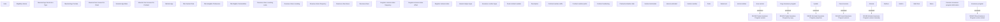

# Show Insurance Program

```mermaid
graph TD
    el_1516729["Note"]
    Eligibility_criteria["Eligibility criteria"]
    Maximal_Age_Restriction_Type["Maximal Age Restriction Type"]
    Maximal_Age_Female["Maximal Age Female"]
    Maximal_Sum_Insured_for_Client["Maximal Sum Insured for Client"]
    Maximal_Age_Male["Maximal Age Male"]
    Maximal_Sum_Insured_for_Contract["Maximal Sum Insured for Contract"]
    Minimal_Age["Minimal Age"]
    Tab_Custom_Data["Tab Custom Data"]
    Tab_Ineligible_Professions["Tab Ineligible Professions"]
    Tab_Eligible_Commodities["Tab Eligible Commodities"]
    Revenue_share_rounding_scale["Revenue share rounding scale"]
    Revenue_share_rounding["Revenue share rounding"]
    Revenue_share_frequency["Revenue share frequency"]
    Revenue_share_base["Revenue share base"]
    Revenue_share["Revenue share"]
    Register_inclusion_date_frequency["Register inclusion date frequency"]
    Register_inclusion_date_offset["Register inclusion date offset"]
    Register_inclusion_date["Register inclusion date"]
    Insured_subject_type["Insured subject type"]
    Insurance_contract_type["Insurance contract type"]
    Fixed_contract_number["Fixed contract number"]
    Description["Description"]
    Contract_number_suffix["Contract number suffix"]
    Contract_number_prefix["Contract number prefix"]
    Contract_numbering["Contract numbering"]
    n_08_540_Cancel_Insurance_Program_version["08.540 Cancel Insurance Program version"]
    n_08_580_Activate_Insurance_Program_version_manually["08.580 Activate Insurance Program version manually"]
    n_08_530_Create_Insurance_Program_version["08.530 Create Insurance Program version"]
    n_08_525_Create_Insurance_Program_by_copy["08.525 Create Insurance Program by copy"]
    n_08_550_Set_main_Insurance_Program_properties["08.550 Set main Insurance Program properties"]
    n_08_560_Show_Insurance_Program_version_detail["08.560 Show Insurance Program version detail"]
    Planned_activation_date["Planned activation date"]
    Version_terminated["Version terminated"]
    Version_activated["Version activated"]
    Version_number["Version number"]
    Code["Code"]
    Salesroom["Salesroom"]
    Version_status["Version status"]
    New_version["New version"]
    Copy_Insurance_program["Copy Insurance program"]
    Update["Update"]
    Cancel_version["Cancel version"]
    Activate["Activate"]
    Buttons["Buttons"]
    Valid_to["Valid to"]
    Valid_from["Valid from"]
    Name["Name"]
    Common_Insurance_program_information["Common Insurance program information"]
    Insurance_program["Insurance program"]
    Insurance_program -->|unnamed| n_08_560_Show_Insurance_Program_version_detail
    Update -->|unnamed| n_08_550_Set_main_Insurance_Program_properties
    Copy_Insurance_program -->|unnamed| n_08_525_Create_Insurance_Program_by_copy
    New_version -->|unnamed| n_08_530_Create_Insurance_Program_version
    Activate -->|unnamed| n_08_580_Activate_Insurance_Program_version_manually
    Cancel_version -->|unnamed| n_08_540_Cancel_Insurance_Program_version
```
