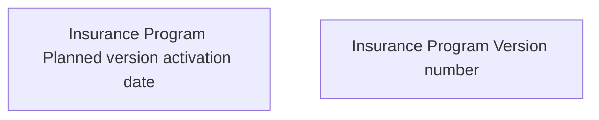

# Validation Rules for Insurance Program Versioned Entity

- **Diagram Type**: Custom
- **Package**: HomerSelect/BSL/Analysis Model/Insurance/Insurance Program - old BSL/Insurance program Root/Validation Rules
- **Diagram ID**: 119903
- **Elements**: 2
- **Connectors**: 0

