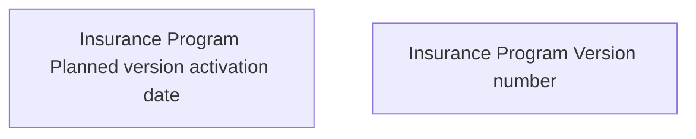

# Validation Rules for Insurance Program Versioned Entity

```mermaid
graph TD
    Insurance_Program_Planned_version_activation_date["Insurance Program Planned version activation date"]
    Insurance_Program_Version_number["Insurance Program Version number"]
```
