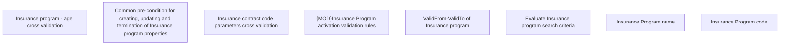

# Validation Rules

```mermaid
graph TD
    Insurance_program_age_cross_validation["Insurance program - age cross validation"]
    Common_pre_condition_for_creating_updating_and_termination_o["Common pre-condition for creating, updating and termination of Insurance program properties "]
    Insurance_contract_code_parameters_cross_validation["Insurance contract code parameters cross validation"]
    MOD_Insurance_Program_activation_validation_rules["{MOD}Insurance Program activation validation rules"]
    ValidFrom_ValidTo_of_Insurance_program["ValidFrom-ValidTo of Insurance program"]
    Evaluate_Insurance_program_search_criteria["Evaluate Insurance program search criteria"]
    Insurance_Program_name["Insurance Program name"]
    Insurance_Program_code["Insurance Program code"]
```
