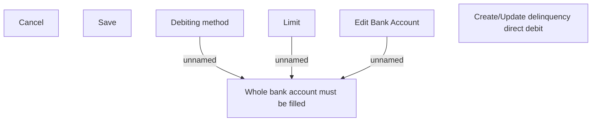

# Create/Update delinquency direct debit

- **Diagram Type**: Custom
- **Package**: HomerSelect/BSL/Analysis Model/Payments/Delinquency direct debit/User Interface Model
- **Diagram ID**: 80201
- **Elements**: 7
- **Connectors**: 3

