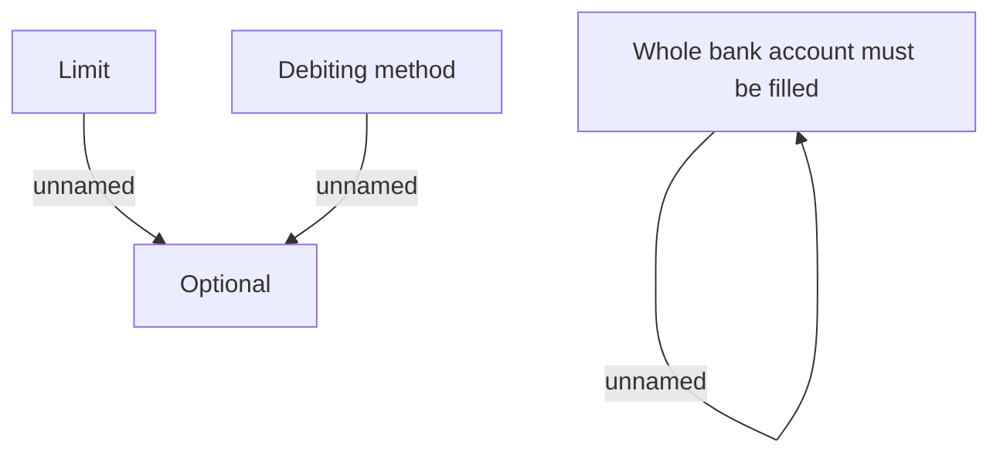

# Validation Rules

- **Diagram Type**: Custom
- **Package**: HomerSelect/BSL/Analysis Model/Payments/Delinquency direct debit/Validation Rules
- **Diagram ID**: 80199
- **Elements**: 5
- **Connectors**: 3

