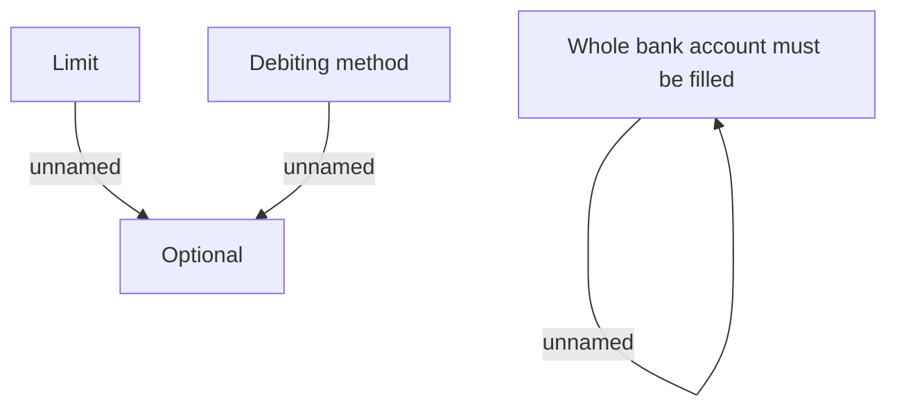

# Validation Rules

```mermaid
graph TD
    Optional["Optional"]
    Limit["Limit"]
    Debiting_method["Debiting method"]
    Whole_bank_account_must_be_filled["Whole bank account must be filled"]
    Whole_bank_account_must_be_filled["Whole bank account must be filled"]
    Whole_bank_account_must_be_filled -->|unnamed| Whole_bank_account_must_be_filled
    Limit -->|unnamed| Optional
    Debiting_method -->|unnamed| Optional
```
