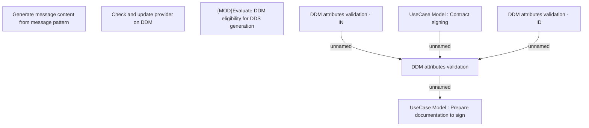

# Business Rules

```mermaid
graph TD
    Generate_message_content_from_message_pattern["Generate message content from message pattern"]
    Check_and_update_provider_on_DDM["Check and update provider on DDM"]
    MOD_Evaluate_DDM_eligibility_for_DDS_generation["{MOD}Evaluate DDM eligibility for DDS generation"]
    DDM_attributes_validation_ID["DDM attributes validation - ID"]
    UseCase_Model_Prepare_documentation_to_sign["UseCase Model : Prepare documentation to sign"]
    UseCase_Model_Contract_signing["UseCase Model : Contract signing"]
    DDM_attributes_validation_IN["DDM attributes validation - IN"]
    DDM_attributes_validation["DDM attributes validation"]
    DDM_attributes_validation -->|unnamed| UseCase_Model_Prepare_documentation_to_sign
    DDM_attributes_validation_IN -->|unnamed| DDM_attributes_validation
    UseCase_Model_Contract_signing -->|unnamed| DDM_attributes_validation
    DDM_attributes_validation_ID -->|unnamed| DDM_attributes_validation
```
