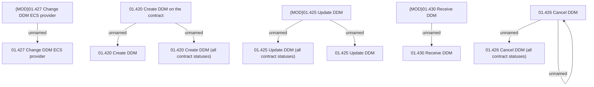

# Access rights

- **Diagram Type**: Custom
- **Package**: HomerSelect/BSL/Analysis Model/Payments/Direct Debit Mandate (DDM)/Create/Update/Receive DDM/Access rights
- **Diagram ID**: 151601
- **Elements**: 13
- **Connectors**: 8

