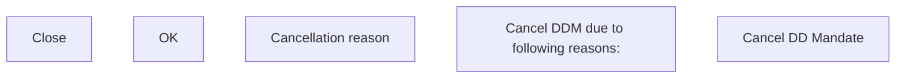

# Cancel DD Mandate - Modal window

- **Diagram Type**: Custom
- **Package**: HomerSelect/BSL/Analysis Model/Payments/Direct Debit Mandate (DDM)/Create/Update/Receive DDM/User Interface Model
- **Diagram ID**: 151611
- **Elements**: 5
- **Connectors**: 0

