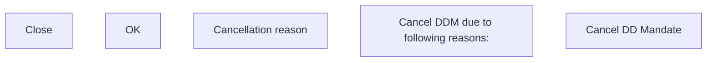

# Cancel DD Mandate - Modal window

```mermaid
graph TD
    Close["Close"]
    OK["OK"]
    Cancellation_reason["Cancellation reason"]
    Cancel_DDM_due_to_following_reasons["Cancel DDM due to following reasons:"]
    Cancel_DD_Mandate["Cancel DD Mandate"]
```
