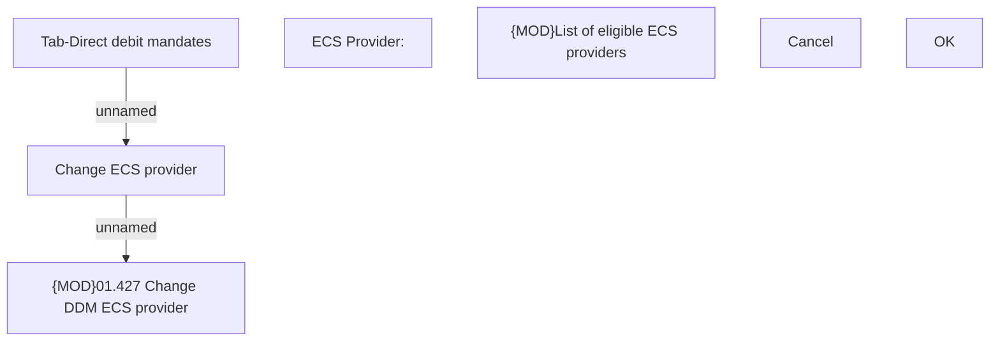

# Change ECS provider

```mermaid
graph TD
    Tab_Direct_debit_mandates["Tab-Direct debit mandates"]
    MOD_01_427_Change_DDM_ECS_provider["{MOD}01.427 Change DDM ECS provider"]
    ECS_Provider["ECS Provider:"]
    MOD_List_of_eligible_ECS_providers["{MOD}List of eligible ECS providers"]
    Cancel["Cancel"]
    OK["OK"]
    Change_ECS_provider["Change ECS provider"]
    Tab_Direct_debit_mandates -->|unnamed| Change_ECS_provider
    Change_ECS_provider -->|unnamed| MOD_01_427_Change_DDM_ECS_provider
```
