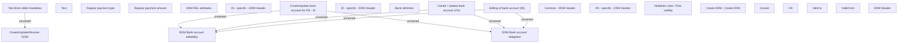

# Create/Update/Receive DDM

```mermaid
graph TD
    Tab_Direct_debit_mandates["Tab-Direct debit mandates"]
    el_1752579["Text"]
    Regular_payment_type["Regular payment type"]
    Regular_payment_amount["Regular payment amount"]
    DDM_REL_attributes["DDM REL attributes"]
    IN_specific_DDM_Header["IN - specific - DDM Header"]
    Create_Update_bank_account_for_DD_ID["Create/Update bank account for DD - ID"]
    ID_specific_DDM_Header["ID - specific - DDM Header"]
    DDM_Bank_account_obligation["DDM Bank account obligation"]
    DDM_Bank_account_editability["DDM Bank account editability"]
    Bank_definition["Bank definition"]
    Create_Update_bank_account_VN["Create / Update bank account (VN)"]
    Editing_of_bank_account_IN["Editing of bank account (IN)"]
    Common_DDM_Header["Common - DDM Header"]
    VN_specific_DDM_Header["VN - specific - DDM Header"]
    Validation_rules_Time_validity["Validation rules :Time validity"]
    Create_DDM_Create_DDM["Create DDM : Create DDM"]
    Cancel["Cancel"]
    OK["OK"]
    Valid_to["Valid to"]
    Valid_from["Valid from"]
    DDM_Header["DDM Header"]
    Create_Update_Receive_DDM["Create/Update/Receive DDM"]
    Tab_Direct_debit_mandates -->|unnamed| Create_Update_Receive_DDM
    Create_Update_bank_account_for_DD_ID -->|unnamed| DDM_Bank_account_editability
    Create_Update_bank_account_VN -->|unnamed| DDM_Bank_account_editability
    Editing_of_bank_account_IN -->|unnamed| DDM_Bank_account_editability
    Create_Update_bank_account_for_DD_ID -->|unnamed| DDM_Bank_account_obligation
    Create_Update_bank_account_VN -->|unnamed| DDM_Bank_account_obligation
    Editing_of_bank_account_IN -->|unnamed| DDM_Bank_account_obligation
```
