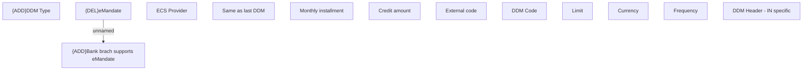

# IN - specific - DDM Header

```mermaid
graph TD
    ADD_Bank_brach_supports_eMandate["{ADD}Bank brach supports eMandate"]
    ADD_DDM_Type["{ADD}DDM Type"]
    DEL_eMandate["{DEL}eMandate"]
    ECS_Provider["ECS Provider"]
    Same_as_last_DDM["Same as last DDM"]
    Monthly_installment["Monthly installment"]
    Credit_amount["Credit amount"]
    External_code["External code"]
    DDM_Code["DDM Code"]
    Limit["Limit"]
    Currency["Currency"]
    Frequency["Frequency"]
    DDM_Header_IN_specific["DDM Header - IN specific"]
    DEL_eMandate -->|unnamed| ADD_Bank_brach_supports_eMandate
```
