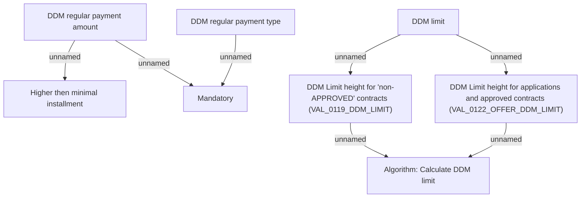

# Create DDM

- **Diagram Type**: Custom
- **Package**: HomerSelect/BSL/Analysis Model/Payments/Direct Debit Mandate (DDM)/Create/Update/Receive DDM/Validation Rules
- **Diagram ID**: 101055
- **Elements**: 8
- **Connectors**: 7

