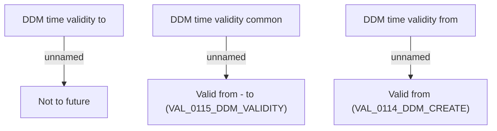

# Time validity

```mermaid
graph TD
    Not_to_future["Not to future"]
    DDM_time_validity_to["DDM time validity to"]
    DDM_time_validity_common["DDM time validity common"]
    Valid_from_to_VAL_0115_DDM_VALIDITY["Valid from - to (VAL_0115_DDM_VALIDITY)"]
    Valid_from_VAL_0114_DDM_CREATE["Valid from (VAL_0114_DDM_CREATE)"]
    DDM_time_validity_from["DDM time validity from"]
    DDM_time_validity_from -->|unnamed| Valid_from_VAL_0114_DDM_CREATE
    DDM_time_validity_common -->|unnamed| Valid_from_to_VAL_0115_DDM_VALIDITY
    DDM_time_validity_to -->|unnamed| Not_to_future
```
