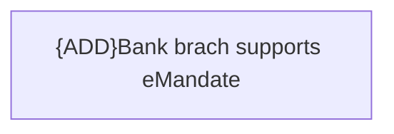

# eMandate validations

- **Diagram Type**: Custom
- **Package**: HomerSelect/BSL/Analysis Model/Payments/Direct Debit Mandate (DDM)/Create/Update/Receive DDM/Validation Rules
- **Diagram ID**: 101057
- **Elements**: 1
- **Connectors**: 0

