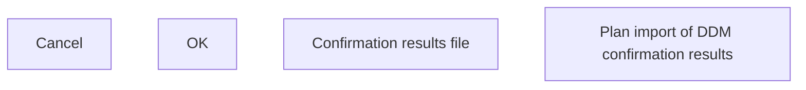

# Plan import of DDM confirmation results

- **Diagram Type**: Custom
- **Package**: HomerSelect/BSL/Analysis Model/Payments/Direct Debit Mandate (DDM)/DDM confirmation/User Interface Model
- **Diagram ID**: 80235
- **Elements**: 4
- **Connectors**: 0

