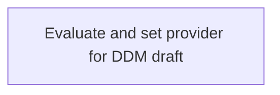

# DDM processing via REST API - Business Rules

- **Diagram Type**: Custom
- **Package**: HomerSelect/BSL/Analysis Model/Payments/Direct Debit Mandate (DDM)/DDM processing via REST API/Business Rules
- **Diagram ID**: 152257
- **Elements**: 1
- **Connectors**: 0

