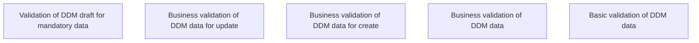

# DDM processing via REST API - Validation Rules

- **Diagram Type**: Custom
- **Package**: HomerSelect/BSL/Analysis Model/Payments/Direct Debit Mandate (DDM)/DDM processing via REST API/Validation Rules
- **Diagram ID**: 152258
- **Elements**: 5
- **Connectors**: 0

