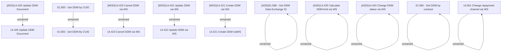

# Access Rights

```mermaid
graph TD
    ADD_14_426_Update_DDM_Document["{ADD}14.426 Update DDM Document"]
    n_14_426_Update_DDM_Document["14.426 Update DDM Document"]
    ADD_01_588_Get_DDM_Data_Exchange_ID["{ADD}01.588 - Get DDM Data Exchange ID"]
    ADD_01_588_Get_DDM_Data_Exchange_ID["{ADD}01.588 - Get DDM Data Exchange ID"]
    ADD_14_425_Calculate_DDM_limit_via_WS["{ADD}14.425 Calculate DDM limit via WS"]
    ADD_14_425_Calculate_DDM_limit_via_WS["{ADD}14.425 Calculate DDM limit via WS"]
    ADD_14_424_Change_DDM_status_via_WS["{ADD}14.424 Change DDM status via WS"]
    ADD_14_424_Change_DDM_status_via_WS["{ADD}14.424 Change DDM status via WS"]
    n_01_583_Get_DDM_by_CUID["01.583 - Get DDM by CUID"]
    n_01_584_Get_DDM_by_contract["01.584 - Get DDM by contract"]
    n_01_583_Get_DDM_By_CUID["01.583 - Get DDM By CUID"]
    n_01_584_Get_DDM_by_contract["01.584 - Get DDM by contract"]
    MOD_14_423_Cancel_DDM_via_WS["{MOD}14.423 Cancel DDM via WS"]
    MOD_14_422_Update_DDM_via_WS["{MOD}14.422 Update DDM via WS"]
    MOD_14_421_Create_DDM_via_WS["{MOD}14.421 Create DDM via WS"]
    n_14_661_Change_repayment_channel_via_WS["14.661 Change repayment channel via WS"]
    n_14_423_Cancel_DDM_via_WS["14.423 Cancel DDM via WS"]
    n_14_422_Update_DDM_via_WS["14.422 Update DDM via WS"]
    n_14_421_Create_DDM_viaWS["14.421 Create DDM viaWS"]
    n_14_661_Change_repayment_channel_via_WS["14.661 Change repayment channel via WS"]
    n_01_584_Get_DDM_by_contract -->|unnamed| n_01_584_Get_DDM_by_contract
    MOD_14_422_Update_DDM_via_WS -->|unnamed| n_14_422_Update_DDM_via_WS
    ADD_14_425_Calculate_DDM_limit_via_WS -->|unnamed| ADD_14_425_Calculate_DDM_limit_via_WS
    n_01_583_Get_DDM_by_CUID -->|unnamed| n_01_583_Get_DDM_By_CUID
    ADD_14_424_Change_DDM_status_via_WS -->|unnamed| ADD_14_424_Change_DDM_status_via_WS
    n_14_661_Change_repayment_channel_via_WS -->|unnamed| n_14_661_Change_repayment_channel_via_WS
    ADD_14_426_Update_DDM_Document -->|unnamed| n_14_426_Update_DDM_Document
    ADD_01_588_Get_DDM_Data_Exchange_ID -->|unnamed| ADD_01_588_Get_DDM_Data_Exchange_ID
    MOD_14_421_Create_DDM_via_WS -->|unnamed| n_14_421_Create_DDM_viaWS
    MOD_14_423_Cancel_DDM_via_WS -->|unnamed| n_14_423_Cancel_DDM_via_WS
```
