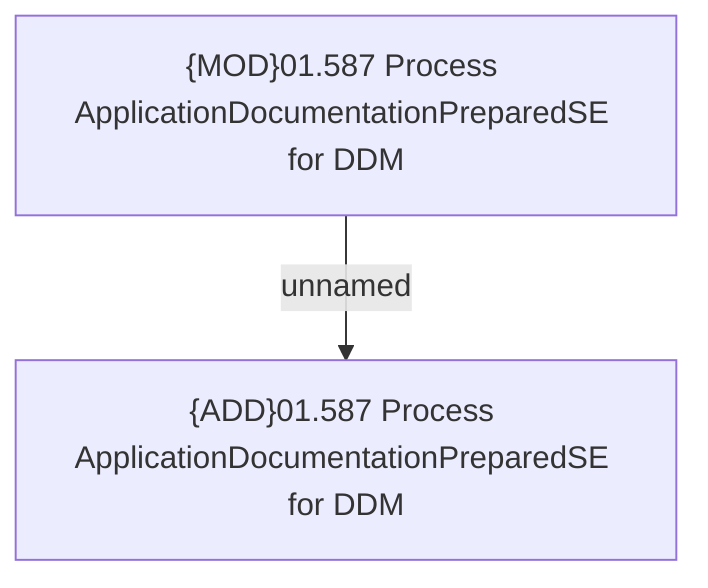

# Access Rights

- **Diagram Type**: Custom
- **Package**: HomerSelect/BSL/Analysis Model/Payments/Direct Debit Mandate (DDM)/Process internal system events and notifications for DDMs/Access Rights
- **Diagram ID**: 112825
- **Elements**: 2
- **Connectors**: 1

