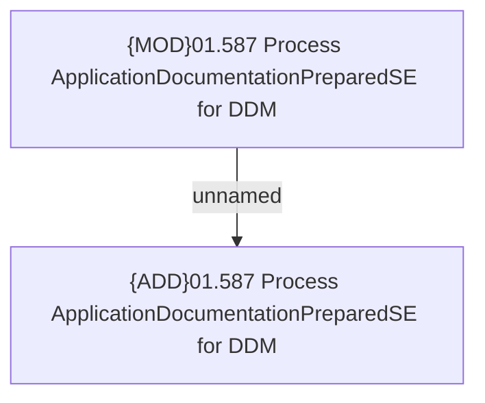

# Access Rights

```mermaid
graph TD
    MOD_01_587_Process_ApplicationDocumentationPreparedSE_for_DD["{MOD}01.587 Process ApplicationDocumentationPreparedSE for DDM"]
    ADD_01_587_Process_ApplicationDocumentationPreparedSE_for_DD["{ADD}01.587 Process ApplicationDocumentationPreparedSE for DDM"]
    MOD_01_587_Process_ApplicationDocumentationPreparedSE_for_DD -->|unnamed| ADD_01_587_Process_ApplicationDocumentationPreparedSE_for_DD
```
