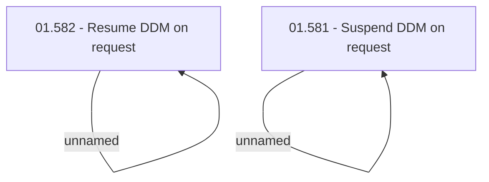

# Access Rights

- **Diagram Type**: Custom
- **Package**: HomerSelect/BSL/Analysis Model/Payments/Direct Debit Mandate (DDM)/Suspend and resume DDM/Access Rights
- **Diagram ID**: 98326
- **Elements**: 4
- **Connectors**: 2

