# Access Rights

- **Diagram Type**: Custom
- **Package**: HomerSelect/BSL/Analysis Model/Payments/Direct Debit Statements/Access Rights
- **Diagram ID**: 98367
- **Elements**: 26
- **Connectors**: 17

```mermaid
graph TD
    n_05_273_Process_DDS_request["05.273 Process DDS request"]
    n_05_272_Process_DDS_requests_message["05.272 Process DDS requests message"]
    n_05_271_Process_DDS_request["05.271 Process DDS request"]
    n_05_273_Process_DDS_requests_message["05.273 Process DDS requests message"]
    n_05_142_Import_DDS_confirmations["05.142 Import DDS confirmations"]
    n_05_141_Import_DD_statements["05.141 Import DD statements"]
    n_05_141_Import_DD_statements["05.141 Import DD statements"]
    n_05_142_Import_DDS_confirmations["05.142 Import DDS confirmations"]
    n_05_270_Process_DDS_requests_file["05.270 Process DDS requests file"]
    n_05_270_Process_DDS_requests_file["05.270 Process DDS requests file"]
    n_05_261_Automatic_Import_DD_confirmations["05.261 Automatic Import DD confirmations"]
    n_05_261_Automatic_Import_DD_confirmations["05.261 Automatic Import DD confirmations"]
    n_05_251_Automatic_Import_DD_statements["05.251 Automatic Import DD statements "]
    n_05_251_Automatic_Import_DD_statements["05.251 Automatic Import DD statements"]
    n_05_260_Process_DD_confirmations_import["05.260 Process DD confirmations import"]
    n_05_250_Process_DD_statements_import["05.250 Process DD statements import"]
    n_05_170_Show_DD_statement_detail["05.170 Show DD statement detail"]
    n_05_160_Generate_DD_statement_file["05.160 Generate DD statement file"]
    n_05_150_Browse_DD_statements["05.150 Browse DD statements"]
    n_05_130_Generate_DD_statements["05.130 Generate DD statements"]
    n_05_260_Process_DD_confirmations_import["05.260 Process DD confirmations import"]
    n_05_250_Process_DD_statements_import["05.250 Process DD statements import"]
    n_05_170_Show_DD_statement_detail["05.170 Show DD statement detail"]
    MOD_05_160_Generate_DD_statement_file["{MOD}05.160 Generate DD statement file"]
    n_05_150_Browse_DD_statements["05.150 Browse DD statements"]
    n_05_130_Generate_DD_statements["05.130 Generate DD statements"]
    n_05_273_Process_DDS_requests_message -->|unnamed| n_05_271_Process_DDS_request
    n_05_270_Process_DDS_requests_file -->|unnamed| n_05_271_Process_DDS_request
    n_05_270_Process_DDS_requests_file -->|unnamed| n_05_270_Process_DDS_requests_file
    n_05_141_Import_DD_statements -->|unnamed| n_05_250_Process_DD_statements_import
    n_05_250_Process_DD_statements_import -->|unnamed| n_05_250_Process_DD_statements_import
    n_05_261_Automatic_Import_DD_confirmations -->|unnamed| n_05_261_Automatic_Import_DD_confirmations
    n_05_170_Show_DD_statement_detail -->|unnamed| n_05_170_Show_DD_statement_detail
    MOD_05_160_Generate_DD_statement_file -->|unnamed| n_05_160_Generate_DD_statement_file
    n_05_150_Browse_DD_statements -->|unnamed| n_05_150_Browse_DD_statements
    n_05_142_Import_DDS_confirmations -->|unnamed| n_05_260_Process_DD_confirmations_import
    n_05_142_Import_DDS_confirmations -->|unnamed| n_05_142_Import_DDS_confirmations
    n_05_273_Process_DDS_requests_message -->|unnamed| n_05_272_Process_DDS_requests_message
    n_05_130_Generate_DD_statements -->|unnamed| n_05_130_Generate_DD_statements
    n_05_251_Automatic_Import_DD_statements -->|unnamed| n_05_251_Automatic_Import_DD_statements
    n_05_141_Import_DD_statements -->|unnamed| n_05_141_Import_DD_statements
    n_05_260_Process_DD_confirmations_import -->|unnamed| n_05_260_Process_DD_confirmations_import
    n_05_271_Process_DDS_request -->|unnamed| n_05_273_Process_DDS_request
```

