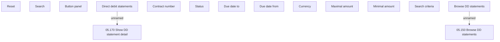

# Browse DD Statements

- **Diagram Type**: Custom
- **Package**: HomerSelect/BSL/Analysis Model/Payments/Direct Debit Statements/User Interface Model
- **Diagram ID**: 98302
- **Elements**: 15
- **Connectors**: 2

