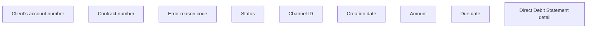

# Direct Debit Statement detail 

```mermaid
graph TD
    Client_s_account_number["Client’s account number"]
    Contract_number["Contract number"]
    Error_reason_code["Error reason code"]
    Status["Status"]
    Channel_ID["Channel ID"]
    Creation_date["Creation date"]
    Amount["Amount"]
    Due_date["Due date"]
    Direct_Debit_Statement_detail["Direct Debit Statement detail"]
```
