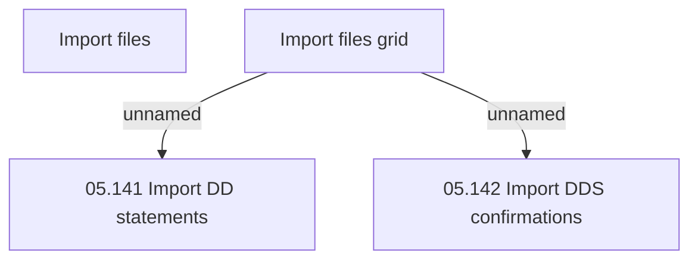

# Import files grid

- **Diagram Type**: Custom
- **Package**: HomerSelect/BSL/Analysis Model/Payments/Direct Debit Statements/User Interface Model
- **Diagram ID**: 98303
- **Elements**: 4
- **Connectors**: 2

