# Business Rules

- **Diagram Type**: Custom
- **Package**: HomerSelect/BSL/Analysis Model/Payments/Incoming payments/COMMON for Incoming Payments/Business Rules
- **Diagram ID**: 99091
- **Elements**: 8
- **Connectors**: 0

```mermaid
graph TD
    Special_incoming_payments["Special incoming payments"]
    Payment_division_allowed["Payment division allowed"]
    Amount_range_validation["Amount range validation"]
    Incoming_payment_active["Incoming payment active"]
    Positive_amount["Positive amount"]
    Check_if_Contract_exists["Check if Contract exists"]
    External_Reference["External Reference"]
    MOD_Contract_pairing_allowed["{MOD}Contract pairing allowed"]
```

