# Access Rights

- **Diagram Type**: Custom
- **Package**: HomerSelect/BSL/Analysis Model/Payments/Incoming payments/Management of incoming payments /Access Rights
- **Diagram ID**: 161975
- **Elements**: 22
- **Connectors**: 11

```mermaid
graph TD
    n_05_070_Divide_incoming_payment["05.070 Divide incoming payment"]
    n_05_081_Create_small_underpayment["05.081 Create small underpayment"]
    n_05_081_Create_small_underpayment["05.081 Create small underpayment"]
    n_14_410_Export_of_Incoming_Payments["14.410 Export of Incoming Payments"]
    n_05_340_Get_payments["05.340 Get payments"]
    n_05_047_Perform_incoming_payment_cancellation_tasks["05.047 Perform  incoming payment cancellation tasks"]
    n_05_047_Perform_incoming_payment_cancellation_tasks["05.047 Perform  incoming payment cancellation tasks"]
    External_Reference["External Reference"]
    External_Reference["External Reference"]
    External_Reference["External Reference"]
    External_Reference["External Reference"]
    External_Reference["External Reference"]
    External_Reference["External Reference"]
    External_Reference["External Reference"]
    External_Reference["External Reference"]
    n_05_046_Cancel_special_payments["05.046 Cancel special payments"]
    n_05_045_Cancel_incoming_payment["05.045 Cancel incoming payment"]
    n_05_045_Cancel_incoming_payment["05.045 Cancel incoming payment"]
    n_05_040_Cancel_incoming_payment_manually["05.040 Cancel incoming payment manually"]
    n_05_080_Create_incoming_payment_manually["05.080 Create incoming payment manually"]
    n_05_050_Show_incoming_payment_detail["05.050 Show incoming payment detail"]
    n_05_020_Browse_incoming_payments["05.020 Browse incoming payments"]
    External_Reference -->|External Reference| n_05_045_Cancel_incoming_payment
    External_Reference -->|External Reference| n_05_045_Cancel_incoming_payment
    External_Reference -->|External Reference| n_05_045_Cancel_incoming_payment
    n_05_046_Cancel_special_payments -->|External Reference| n_05_045_Cancel_incoming_payment
    External_Reference -->|External Reference| n_05_046_Cancel_special_payments
    External_Reference -->|External Reference| External_Reference
    External_Reference -->|External Reference| External_Reference
    External_Reference -->|External Reference| External_Reference
    External_Reference -->|External Reference| External_Reference
    n_05_045_Cancel_incoming_payment -->|unnamed| n_05_045_Cancel_incoming_payment
    n_05_081_Create_small_underpayment -->|unnamed| n_05_081_Create_small_underpayment
```

