# Business Rules

- **Diagram Type**: Custom
- **Package**: HomerSelect/BSL/Analysis Model/Payments/Incoming payments/Management of incoming payments /Business Rules
- **Diagram ID**: 161902
- **Elements**: 14
- **Connectors**: 0

```mermaid
graph TD
    Export_file_list_of_incoming_payments["Export file - list of incoming payments"]
    Create_incoming_payment_rule["Create incoming payment rule"]
    ALG_Divide_incoming_payment["ALG_Divide incoming payment"]
    Positive_amount["Positive amount"]
    Perform_incoming_payment_cancellation["Perform incoming payment cancellation"]
    Payment_division_allowed["Payment division allowed"]
    Incoming_payment_types_allowed_to_user_entering["Incoming payment types allowed to user entering"]
    Incoming_payment_pairing_is_not_locked["Incoming payment pairing is not locked"]
    Filter_for_Transaction_date_From_To_for_Incoming_payments["Filter for Transaction date From/To for Incoming payments"]
    Create_Incoming_Payment_request_validation["Create Incoming Payment request validation"]
    Check_if_Contract_exists["Check if Contract exists"]
    Amount_range_validation["Amount range validation"]
    Active_payment_already_exists["Active payment already exists"]
    Incoming_payment_active["Incoming payment active"]
```

