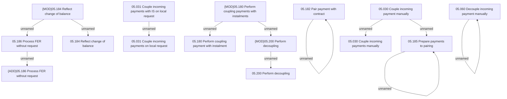

# Access Rights

```mermaid
graph TD
    ADD_05_186_Process_FER_without_request["{ADD}05.186 Process FER without request"]
    n_05_186_Process_FER_without_request["05.186 Process FER without request"]
    n_05_185_Prepare_payments_to_pairing["05.185 Prepare payments to pairing"]
    n_05_185_Prepare_payments_to_pairing["05.185 Prepare payments to pairing"]
    n_05_031_Couple_incoming_payments_with_IS_on_local_request["05.031 Couple incoming payments with IS on local request"]
    n_05_031_Couple_incoming_payments_on_local_request["05.031 Couple incoming payments on local request"]
    n_05_184_Reflect_change_of_balance["05.184 Reflect change of balance"]
    MOD_05_184_Reflect_change_of_balance["{MOD}05.184 Reflect change of balance"]
    n_05_200_Perform_decoupling["05.200 Perform decoupling"]
    n_05_182_Pair_payment_with_contract["05.182 Pair payment with contract"]
    n_05_180_Perform_coupling_payment_with_instalment["05.180 Perform coupling payment with instalment"]
    n_05_060_Decouple_incoming_payment_manually["05.060 Decouple incoming payment manually"]
    n_05_030_Couple_incoming_payments_manually["05.030 Couple incoming payments manually"]
    MOD_05_200_Perform_decoupling["{MOD}05.200 Perform decoupling"]
    n_05_182_Pair_payment_with_contract["05.182 Pair payment with contract"]
    MOD_05_180_Perform_coupling_payments_with_instalments["{MOD}05.180 Perform coupling payments with instalments"]
    n_05_060_Decouple_incoming_payment_manually["05.060 Decouple incoming payment manually"]
    n_05_030_Couple_incoming_payment_manually["05.030 Couple incoming payment manually"]
    MOD_05_180_Perform_coupling_payments_with_instalments -->|unnamed| n_05_180_Perform_coupling_payment_with_instalment
    MOD_05_180_Perform_coupling_payments_with_instalments -->|unnamed| MOD_05_200_Perform_decoupling
    n_05_030_Couple_incoming_payment_manually -->|unnamed| n_05_030_Couple_incoming_payments_manually
    n_05_030_Couple_incoming_payment_manually -->|unnamed| n_05_185_Prepare_payments_to_pairing
    MOD_05_184_Reflect_change_of_balance -->|unnamed| n_05_186_Process_FER_without_request
    MOD_05_184_Reflect_change_of_balance -->|unnamed| n_05_184_Reflect_change_of_balance
    MOD_05_200_Perform_decoupling -->|unnamed| n_05_200_Perform_decoupling
    n_05_185_Prepare_payments_to_pairing -->|unnamed| n_05_185_Prepare_payments_to_pairing
    n_05_182_Pair_payment_with_contract -->|unnamed| n_05_182_Pair_payment_with_contract
    n_05_031_Couple_incoming_payments_with_IS_on_local_request -->|unnamed| n_05_031_Couple_incoming_payments_on_local_request
    n_05_060_Decouple_incoming_payment_manually -->|unnamed| n_05_060_Decouple_incoming_payment_manually
    n_05_186_Process_FER_without_request -->|unnamed| ADD_05_186_Process_FER_without_request
```
