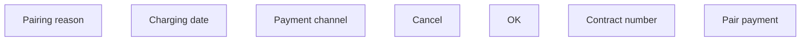

# Couple incoming payment to contract

- **Diagram Type**: Custom
- **Package**: HomerSelect/BSL/Analysis Model/Payments/Incoming payments/Pairing incomming payments/User Interface
- **Diagram ID**: 98305
- **Elements**: 7
- **Connectors**: 0

