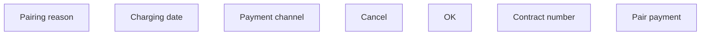

# Couple incoming payment to contract

```mermaid
graph TD
    Pairing_reason["Pairing reason"]
    Charging_date["Charging date"]
    Payment_channel["Payment channel"]
    Cancel["Cancel"]
    OK["OK"]
    Contract_number["Contract number"]
    Pair_payment["Pair payment"]
```
