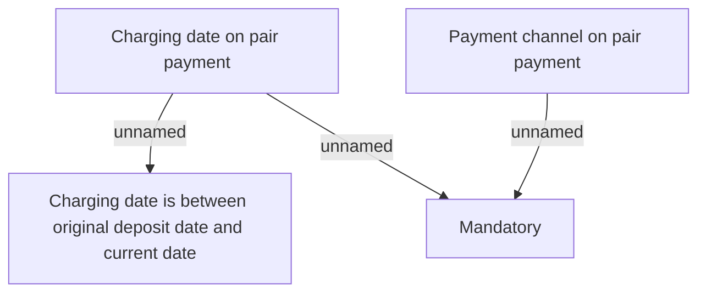

# Validation rules

```mermaid
graph TD
    Charging_date_is_between_original_deposit_date_and_current_d["Charging date is between original deposit date and current date"]
    Charging_date_on_pair_payment["Charging date on pair payment"]
    Mandatory["Mandatory"]
    Payment_channel_on_pair_payment["Payment channel on pair payment"]
    Charging_date_on_pair_payment -->|unnamed| Charging_date_is_between_original_deposit_date_and_current_d
    Charging_date_on_pair_payment -->|unnamed| Mandatory
    Payment_channel_on_pair_payment -->|unnamed| Mandatory
```
