# Access Rights

- **Diagram Type**: Custom
- **Package**: HomerSelect/BSL/Analysis Model/Payments/Outgoing payments/Browsing Outgoing Payments/Access Rights
- **Diagram ID**: 121499
- **Elements**: 17
- **Connectors**: 14

```mermaid
graph TD
    n_05_102_Show_outgoing_payment_detail["05.102 Show outgoing payment detail"]
    n_05_102_Show_outgoing_payment_detail["05.102 Show outgoing payment detail"]
    n_05_100_Browse_outgoing_payments_UNSUCCESSFUL_DISBURSEMENT["05.100 Browse outgoing payments - UNSUCCESSFUL DISBURSEMENT"]
    n_05_101_Export_outgoing_payments["05.101 Export outgoing payments"]
    n_05_101_Export_outgoing_payments["05.101 Export outgoing payments"]
    n_05_100_Browse_outgoing_payments_CUSTOM["05.100 Browse outgoing payments - CUSTOM"]
    n_05_100_Browse_outgoing_payments_ORIGINATING_POS["05.100 Browse outgoing payments - ORIGINATING POS"]
    n_05_100_Browse_outgoing_payments_CANCELED["05.100 Browse outgoing payments - CANCELED"]
    n_05_100_Browse_outgoing_payments_BLOCKED["05.100 Browse outgoing payments - BLOCKED"]
    n_05_100_Browse_outgoing_payments_CONTRACT["05.100 Browse outgoing payments - CONTRACT"]
    n_05_100_Browse_outgoing_payments_PARTNER["05.100 Browse outgoing payments - PARTNER"]
    n_05_100_Browse_outgoing_payments_POS["05.100 Browse outgoing payments - POS"]
    n_05_100_Browse_outgoing_payments_PAID["05.100 Browse outgoing payments - PAID"]
    n_05_100_Browse_outgoing_payments_UNPAID["05.100 Browse outgoing payments - UNPAID"]
    n_05_100_Browse_outgoing_payments_STANDARD["05.100 Browse outgoing payments - STANDARD"]
    n_05_100_Browse_outgoing_payments["05.100 Browse outgoing payments"]
    n_05_100_Browse_outgoing_payments["05.100 Browse outgoing payments"]
    n_05_101_Export_outgoing_payments -->|unnamed| n_05_101_Export_outgoing_payments
    n_05_100_Browse_outgoing_payments -->|unnamed| n_05_100_Browse_outgoing_payments_CONTRACT
    n_05_100_Browse_outgoing_payments -->|unnamed| n_05_100_Browse_outgoing_payments_UNPAID
    n_05_100_Browse_outgoing_payments -->|unnamed| n_05_100_Browse_outgoing_payments_ORIGINATING_POS
    n_05_100_Browse_outgoing_payments -->|unnamed| n_05_100_Browse_outgoing_payments_UNSUCCESSFUL_DISBURSEMENT
    n_05_100_Browse_outgoing_payments -->|unnamed| n_05_100_Browse_outgoing_payments_POS
    n_05_100_Browse_outgoing_payments -->|unnamed| n_05_100_Browse_outgoing_payments_STANDARD
    n_05_100_Browse_outgoing_payments -->|unnamed| n_05_100_Browse_outgoing_payments_PAID
    n_05_100_Browse_outgoing_payments -->|unnamed| n_05_100_Browse_outgoing_payments_CANCELED
    n_05_100_Browse_outgoing_payments -->|unnamed| n_05_100_Browse_outgoing_payments_BLOCKED
    n_05_100_Browse_outgoing_payments -->|unnamed| n_05_100_Browse_outgoing_payments_PARTNER
    n_05_100_Browse_outgoing_payments -->|unnamed| n_05_100_Browse_outgoing_payments
    n_05_100_Browse_outgoing_payments -->|unnamed| n_05_100_Browse_outgoing_payments_CUSTOM
    n_05_102_Show_outgoing_payment_detail -->|unnamed| n_05_102_Show_outgoing_payment_detail
```

