# Browse outgoing payments screen

- **Diagram Type**: Custom
- **Package**: HomerSelect/BSL/Analysis Model/Payments/Outgoing payments/Browsing Outgoing Payments/User Interface model
- **Diagram ID**: 129450
- **Elements**: 43
- **Connectors**: 9

```mermaid
graph TD
    User_Interface_model_Show_outgoing_payment_detail["User Interface model : Show outgoing payment detail"]
    Search_criteria_UNSUCCESSFUL_DISBURSEMENT["Search criteria - UNSUCCESSFUL DISBURSEMENT"]
    Export_results["Export results"]
    n_05_101_Export_outgoing_payments["05.101 Export outgoing payments"]
    Determinate_Transaction_Code_for_Outgoing_payment["Determinate Transaction Code for Outgoing payment"]
    MOD_Get_recipient_data["{MOD}Get recipient data"]
    Generate_orders["Generate orders"]
    Number_of_payment_orders["Number of payment orders"]
    Total_amount["Total amount"]
    Number_of_payments["Number of payments"]
    Number_of_contracts["Number of contracts"]
    Found_payments["Found payments"]
    Search_criteria_CANCELED["Search criteria - CANCELED"]
    Search_criteria_PARTNER["Search criteria - PARTNER"]
    Custom["Custom"]
    Originating_POS["Originating POS"]
    Canceled["Canceled"]
    Blocked["Blocked"]
    Contract["Contract"]
    Partner["Partner"]
    POS["POS"]
    Unpaid["Unpaid"]
    Paid["Paid"]
    Standard["Standard"]
    Search_criteria_CUSTOM["Search criteria - CUSTOM"]
    Search_criteria_ORIGINATING_POS["Search criteria - ORIGINATING POS"]
    Search_criteria_BLOCKED["Search criteria - BLOCKED"]
    Search_criteria_CONTRACT["Search criteria - CONTRACT"]
    Search_criteria_POS["Search criteria - POS"]
    Search_criteria_PAID["Search criteria - PAID"]
    Search_criteria_UNPAID["Search criteria - UNPAID"]
    Search_criteria_STANDARD["Search criteria - STANDARD"]
    Search_criteria["Search criteria"]
    Search_criteria["Search criteria"]
    MOD_01_210_Show_contract_detail["{MOD}01.210 Show contract detail"]
    MOD_05_110_Generate_payment_orders["{MOD}05.110 Generate payment orders"]
    n_05_100_Browse_outgoing_payments["05.100 Browse outgoing payments"]
    n_05_125_Export_dispatch_note_file["05.125 Export dispatch note file"]
    Search_results["Search results"]
    Reset["Reset"]
    Search["Search"]
    Search_buttons["Search buttons"]
    Browse_outgoing_payments["Browse outgoing payments"]
    Browse_outgoing_payments -->|unnamed| n_05_100_Browse_outgoing_payments
    n_05_125_Export_dispatch_note_file -->|unnamed| n_05_100_Browse_outgoing_payments
    Found_payments -->|unnamed| Determinate_Transaction_Code_for_Outgoing_payment
    Found_payments -->|unnamed| MOD_Get_recipient_data
    Found_payments -->|unnamed| MOD_01_210_Show_contract_detail
    Found_payments -->|unnamed| n_05_125_Export_dispatch_note_file
    Found_payments -->|unnamed| User_Interface_model_Show_outgoing_payment_detail
    Generate_orders -->|unnamed| MOD_05_110_Generate_payment_orders
    Export_results -->|unnamed| n_05_101_Export_outgoing_payments
```

