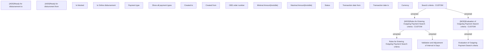

# Search criteria - CUSTOM

```mermaid
graph TD
    ADD_Ready_for_disbursement_to["{ADD}Ready for disbursement to"]
    ADD_Ready_for_disbursment_from["{ADD}Ready for disbursment from"]
    Is_blocked["Is blocked"]
    Is_Online_disbursement["Is Online disbursement"]
    Validation_and_Adjustment_of_Interval_in_Days["Validation and Adjustment of Interval in Days"]
    Payment_type["Payment type"]
    Show_all_payment_types["Show all payment types"]
    Created_to["Created to"]
    Created_from["Created from"]
    OBS_order_number["OBS order number"]
    Minimal_Amount_invisible["Minimal Amount{invisible}"]
    Maximal_Amount_invisible["Maximal Amount{invisible}"]
    Status["Status"]
    Transaction_date_from["Transaction date from"]
    Transaction_date_to["Transaction date to"]
    Currency["Currency"]
    MOD_Evaluation_of_Outgoing_Payment_Search_criteria_CUSTOM["{MOD}Evaluation of Outgoing Payment Search criteria - CUSTOM"]
    MOD_Rules_for_Entering_Outgoing_Payment_Search_criteria_CUST["{MOD}Rules for Entering Outgoing Payment Search criteria - CUSTOM"]
    Evaluation_of_Outgoing_Payment_Search_criteria["Evaluation of Outgoing Payment Search criteria"]
    Rules_for_Entering_Outgoing_Payment_Search_criteria["Rules for Entering Outgoing Payment Search criteria"]
    Search_criteria_CUSTOM["Search criteria - CUSTOM"]
    Search_criteria_CUSTOM -->|unnamed| MOD_Rules_for_Entering_Outgoing_Payment_Search_criteria_CUST
    Search_criteria_CUSTOM -->|unnamed| MOD_Evaluation_of_Outgoing_Payment_Search_criteria_CUSTOM
    MOD_Rules_for_Entering_Outgoing_Payment_Search_criteria_CUST -->|unnamed| Rules_for_Entering_Outgoing_Payment_Search_criteria
    MOD_Rules_for_Entering_Outgoing_Payment_Search_criteria_CUST -->|unnamed| Validation_and_Adjustment_of_Interval_in_Days
    MOD_Evaluation_of_Outgoing_Payment_Search_criteria_CUSTOM -->|unnamed| Evaluation_of_Outgoing_Payment_Search_criteria
```
