# Search criteria - Items

- **Diagram Type**: Custom
- **Package**: HomerSelect/BSL/Analysis Model/Payments/Outgoing payments/Browsing Outgoing Payments/User Interface model
- **Diagram ID**: 129461
- **Elements**: 21
- **Connectors**: 0

```mermaid
graph TD
    Is_blocked["Is blocked"]
    Is_Online_disbursement["Is Online disbursement"]
    Currency["Currency"]
    Amount_sum_limit["Amount sum limit"]
    Payment_type["Payment type"]
    Show_all_payment_types["Show all payment types"]
    Originating_Salesroom["Originating Salesroom"]
    Addressed_to_Salesroom["Addressed to Salesroom"]
    Addressed_to_Partner["Addressed to Partner"]
    Created_to["Created to"]
    Created_from["Created from"]
    OBS_order_number["OBS order number"]
    Contract["Contract"]
    Minimal_Amount_invisible["Minimal Amount{invisible}"]
    Maximal_Amount_invisible["Maximal Amount{invisible}"]
    Status["Status"]
    Transaction_date_from["Transaction date from"]
    Transaction_date_to["Transaction date to"]
    Currency["Currency"]
    el_1538436["Note"]
    Search_criteria_items["Search criteria - items"]
```

