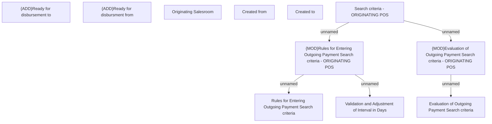

# Search criteria - ORIGINATING POS

```mermaid
graph TD
    ADD_Ready_for_disbursement_to["{ADD}Ready for disbursement to"]
    ADD_Ready_for_disbursment_from["{ADD}Ready for disbursment from"]
    Validation_and_Adjustment_of_Interval_in_Days["Validation and Adjustment of Interval in Days"]
    Originating_Salesroom["Originating Salesroom"]
    Created_from["Created from"]
    Created_to["Created to"]
    MOD_Evaluation_of_Outgoing_Payment_Search_criteria_ORIGINATI["{MOD}Evaluation of Outgoing Payment Search criteria - ORIGINATING POS"]
    MOD_Rules_for_Entering_Outgoing_Payment_Search_criteria_ORIG["{MOD}Rules for Entering Outgoing Payment Search criteria - ORIGINATING POS"]
    Evaluation_of_Outgoing_Payment_Search_criteria["Evaluation of Outgoing Payment Search criteria"]
    Rules_for_Entering_Outgoing_Payment_Search_criteria["Rules for Entering Outgoing Payment Search criteria"]
    Search_criteria_ORIGINATING_POS["Search criteria - ORIGINATING POS"]
    Search_criteria_ORIGINATING_POS -->|unnamed| MOD_Rules_for_Entering_Outgoing_Payment_Search_criteria_ORIG
    Search_criteria_ORIGINATING_POS -->|unnamed| MOD_Evaluation_of_Outgoing_Payment_Search_criteria_ORIGINATI
    MOD_Rules_for_Entering_Outgoing_Payment_Search_criteria_ORIG -->|unnamed| Rules_for_Entering_Outgoing_Payment_Search_criteria
    MOD_Rules_for_Entering_Outgoing_Payment_Search_criteria_ORIG -->|unnamed| Validation_and_Adjustment_of_Interval_in_Days
    MOD_Evaluation_of_Outgoing_Payment_Search_criteria_ORIGINATI -->|unnamed| Evaluation_of_Outgoing_Payment_Search_criteria
```
