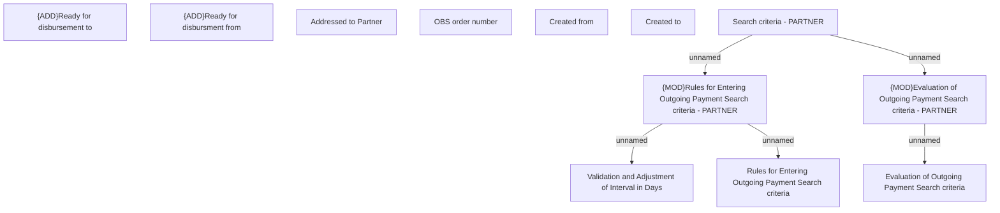

# Search criteria - PARTNER

```mermaid
graph TD
    ADD_Ready_for_disbursement_to["{ADD}Ready for disbursement to"]
    ADD_Ready_for_disbursment_from["{ADD}Ready for disbursment from"]
    Validation_and_Adjustment_of_Interval_in_Days["Validation and Adjustment of Interval in Days"]
    Addressed_to_Partner["Addressed to Partner"]
    OBS_order_number["OBS order number"]
    Created_from["Created from"]
    Created_to["Created to"]
    MOD_Evaluation_of_Outgoing_Payment_Search_criteria_PARTNER["{MOD}Evaluation of Outgoing Payment Search criteria - PARTNER"]
    MOD_Rules_for_Entering_Outgoing_Payment_Search_criteria_PART["{MOD}Rules for Entering Outgoing Payment Search criteria - PARTNER"]
    Evaluation_of_Outgoing_Payment_Search_criteria["Evaluation of Outgoing Payment Search criteria"]
    Rules_for_Entering_Outgoing_Payment_Search_criteria["Rules for Entering Outgoing Payment Search criteria"]
    Search_criteria_PARTNER["Search criteria - PARTNER"]
    Search_criteria_PARTNER -->|unnamed| MOD_Rules_for_Entering_Outgoing_Payment_Search_criteria_PART
    Search_criteria_PARTNER -->|unnamed| MOD_Evaluation_of_Outgoing_Payment_Search_criteria_PARTNER
    MOD_Rules_for_Entering_Outgoing_Payment_Search_criteria_PART -->|unnamed| Validation_and_Adjustment_of_Interval_in_Days
    MOD_Rules_for_Entering_Outgoing_Payment_Search_criteria_PART -->|unnamed| Rules_for_Entering_Outgoing_Payment_Search_criteria
    MOD_Evaluation_of_Outgoing_Payment_Search_criteria_PARTNER -->|unnamed| Evaluation_of_Outgoing_Payment_Search_criteria
```
