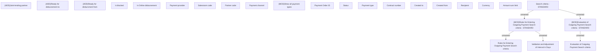

# Search criteria - STANDARD

```mermaid
graph TD
    ADD_Joint_lending_partner["{ADD}Joint-lending partner"]
    ADD_Ready_for_disbursement_to["{ADD}Ready for disbursement to"]
    ADD_Ready_for_disbursment_from["{ADD}Ready for disbursment from"]
    Is_blocked["Is blocked"]
    Is_Online_disbursement["Is Online disbursement"]
    Validation_and_Adjustment_of_Interval_in_Days["Validation and Adjustment of Interval in Days"]
    Evaluation_of_Outgoing_Payment_Search_criteria["Evaluation of Outgoing Payment Search criteria"]
    Rules_for_Entering_Outgoing_Payment_Search_criteria["Rules for Entering Outgoing Payment Search criteria"]
    MOD_Evaluation_of_Outgoing_Payment_Search_criteria_STANDARD["{MOD}Evaluation of Outgoing Payment Search criteria - STANDARD"]
    MOD_Rules_for_Entering_Outgoing_Payment_Search_criteria_STAN["{MOD}Rules for Entering Outgoing Payment Search criteria - STANDARD"]
    Payment_provider["Payment provider"]
    Salesroom_code["Salesroom code"]
    Partner_code["Partner code"]
    Payment_channel["Payment channel"]
    MOD_Show_all_payment_types["{MOD}Show all payment types"]
    Payment_Order_ID["Payment Order ID"]
    Status["Status"]
    Payment_type["Payment type"]
    Contract_number["Contract number"]
    Created_to["Created to"]
    Created_from["Created from"]
    Recipient["Recipient"]
    Currency["Currency"]
    Amount_sum_limit["Amount sum limit"]
    Search_criteria_STANDARD["Search criteria - STANDARD"]
    Search_criteria_STANDARD -->|unnamed| MOD_Rules_for_Entering_Outgoing_Payment_Search_criteria_STAN
    Search_criteria_STANDARD -->|unnamed| MOD_Evaluation_of_Outgoing_Payment_Search_criteria_STANDARD
    MOD_Rules_for_Entering_Outgoing_Payment_Search_criteria_STAN -->|unnamed| Rules_for_Entering_Outgoing_Payment_Search_criteria
    MOD_Rules_for_Entering_Outgoing_Payment_Search_criteria_STAN -->|unnamed| Validation_and_Adjustment_of_Interval_in_Days
    MOD_Evaluation_of_Outgoing_Payment_Search_criteria_STANDARD -->|unnamed| Evaluation_of_Outgoing_Payment_Search_criteria
```
