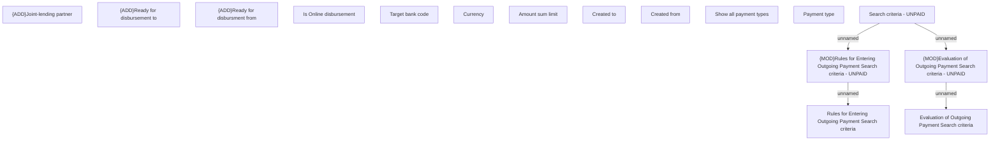

# Search criteria - UNPAID

```mermaid
graph TD
    ADD_Joint_lending_partner["{ADD}Joint-lending partner"]
    ADD_Ready_for_disbursement_to["{ADD}Ready for disbursement to"]
    ADD_Ready_for_disbursment_from["{ADD}Ready for disbursment from"]
    Is_Online_disbursement["Is Online disbursement"]
    Target_bank_code["Target bank code"]
    Currency["Currency"]
    Amount_sum_limit["Amount sum limit"]
    Created_to["Created to"]
    Created_from["Created from"]
    Show_all_payment_types["Show all payment types"]
    Payment_type["Payment type"]
    MOD_Evaluation_of_Outgoing_Payment_Search_criteria_UNPAID["{MOD}Evaluation of Outgoing Payment Search criteria - UNPAID"]
    MOD_Rules_for_Entering_Outgoing_Payment_Search_criteria_UNPA["{MOD}Rules for Entering Outgoing Payment Search criteria - UNPAID"]
    Evaluation_of_Outgoing_Payment_Search_criteria["Evaluation of Outgoing Payment Search criteria"]
    Rules_for_Entering_Outgoing_Payment_Search_criteria["Rules for Entering Outgoing Payment Search criteria"]
    Search_criteria_UNPAID["Search criteria - UNPAID"]
    Search_criteria_UNPAID -->|unnamed| MOD_Rules_for_Entering_Outgoing_Payment_Search_criteria_UNPA
    Search_criteria_UNPAID -->|unnamed| MOD_Evaluation_of_Outgoing_Payment_Search_criteria_UNPAID
    MOD_Rules_for_Entering_Outgoing_Payment_Search_criteria_UNPA -->|unnamed| Rules_for_Entering_Outgoing_Payment_Search_criteria
    MOD_Evaluation_of_Outgoing_Payment_Search_criteria_UNPAID -->|unnamed| Evaluation_of_Outgoing_Payment_Search_criteria
```
