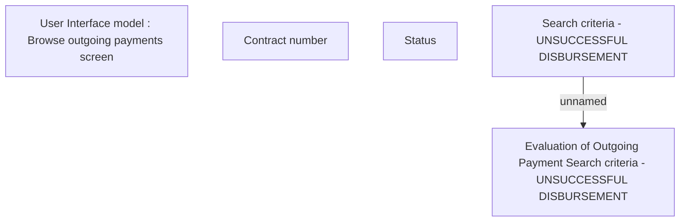

# Search criteria - UNSUCCESSFUL DISBURSEMENT

- **Diagram Type**: Custom
- **Package**: HomerSelect/BSL/Analysis Model/Payments/Outgoing payments/Browsing Outgoing Payments/User Interface model
- **Diagram ID**: 129462
- **Elements**: 5
- **Connectors**: 1

