# Show outgoing payment detail

- **Diagram Type**: Custom
- **Package**: HomerSelect/BSL/Analysis Model/Payments/Outgoing payments/Browsing Outgoing Payments/User Interface model
- **Diagram ID**: 129463
- **Elements**: 26
- **Connectors**: 1

```mermaid
graph TD
    Extended_informations["Extended informations"]
    Extended_property["Extended property"]
    Contract_Detail["Contract Detail"]
    n_05_102_Show_outgoing_payment_detail["05.102 Show outgoing payment detail"]
    MOD_Payment_confirmation_date["{MOD}Payment confirmation date"]
    OBS_order_number["OBS order number"]
    Back["Back"]
    Outgoing_payment_detail_buttons["Outgoing payment detail buttons"]
    Transaction_ID["Transaction ID"]
    Status["Status"]
    Salesroom_code["Salesroom code"]
    Payment_type["Payment type"]
    Payment_order_ID["Payment order ID"]
    Payable_date["Payable date"]
    Disbursement_initation_by_co_lender["Disbursement initation by co-lender"]
    Creation_Time["Creation Time"]
    Amount["Amount"]
    Recipient["Recipient"]
    Payment_channel["Payment channel"]
    Partner_code["Partner code"]
    Order_generation_date["Order generation date"]
    Contract_number["Contract number"]
    Online_disbursement["Online disbursement"]
    Blocking_status["Blocking status"]
    Join_lending_partner["Join lending partner"]
    Outgoing_Payment_detail["Outgoing Payment detail"]
    Outgoing_Payment_detail -->|unnamed| n_05_102_Show_outgoing_payment_detail
```

