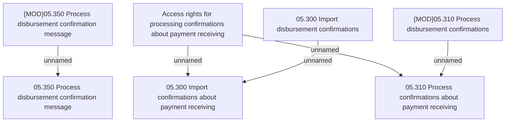

# Access Rights

- **Diagram Type**: Custom
- **Package**: HomerSelect/BSL/Analysis Model/Payments/Outgoing payments/Disbursement confirmation/Access Rights
- **Diagram ID**: 66199
- **Elements**: 7
- **Connectors**: 5

