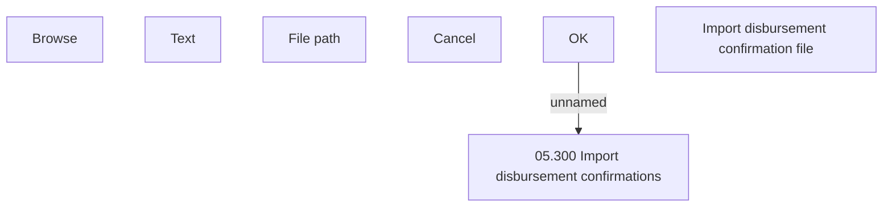

# Import disbursement confirmation file dialog screen

- **Diagram Type**: Custom
- **Package**: HomerSelect/BSL/Analysis Model/Payments/Outgoing payments/Disbursement confirmation/User Interface Model
- **Diagram ID**: 52252
- **Elements**: 7
- **Connectors**: 1

