# Outgoing payments file detail screen

- **Diagram Type**: Custom
- **Package**: HomerSelect/BSL/Analysis Model/Payments/Outgoing payments/Outgoing  payment files management/User Interface
- **Diagram ID**: 51278
- **Elements**: 15
- **Connectors**: 3

```mermaid
graph TD
    n_05_115_Export_outgoing_payment_order_file["05.115 Export outgoing payment order file"]
    n_05_125_Export_dispatch_note_file["05.125 Export dispatch note file"]
    n_05_215_Print_outgoing_file_for_signing["05.215 Print outgoing file for signing"]
    Print_file["Print file"]
    Payment_orders_in_file["Payment orders in file"]
    Outgoing_payment_orders["Outgoing payment orders"]
    Export_file["Export file"]
    Buttons["Buttons"]
    Count_of_payment_orders["Count of payment orders"]
    Creation_time["Creation time"]
    HC_Bank_account["HC Bank account"]
    Amount_sum["Amount sum"]
    File_name["File name"]
    Outgoing_payments_file_detail["Outgoing payments file detail"]
    Outgoing_payments_file_detail["Outgoing payments file detail"]
    Print_file -->|unnamed| n_05_215_Print_outgoing_file_for_signing
    Payment_orders_in_file -->|unnamed| n_05_125_Export_dispatch_note_file
    Export_file -->|unnamed| n_05_115_Export_outgoing_payment_order_file
```

