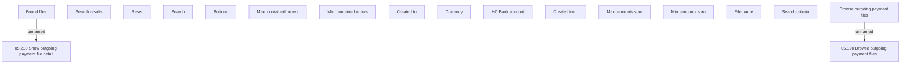

# Browse outgoing payment files screen

```mermaid
graph TD
    n_05_210_Show_outgoing_payment_file_detail["05.210 Show outgoing payment file detail"]
    n_05_190_Browse_outgoing_payment_files["05.190 Browse outgoing payment files"]
    Found_files["Found files"]
    Search_results["Search results"]
    Reset["Reset"]
    Search["Search"]
    Buttons["Buttons"]
    Max_contained_orders["Max. contained orders"]
    Min_contained_orders["Min. contained orders"]
    Created_to["Created to"]
    Currency["Currency"]
    HC_Bank_account["HC Bank account"]
    Created_from["Created from"]
    Max_amounts_sum["Max. amounts sum"]
    Min_amounts_sum["Min. amounts sum"]
    File_name["File name"]
    Search_criteria["Search criteria"]
    Browse_outgoing_payment_files["Browse outgoing payment files"]
    Browse_outgoing_payment_files -->|unnamed| n_05_190_Browse_outgoing_payment_files
    Found_files -->|unnamed| n_05_210_Show_outgoing_payment_file_detail
```
