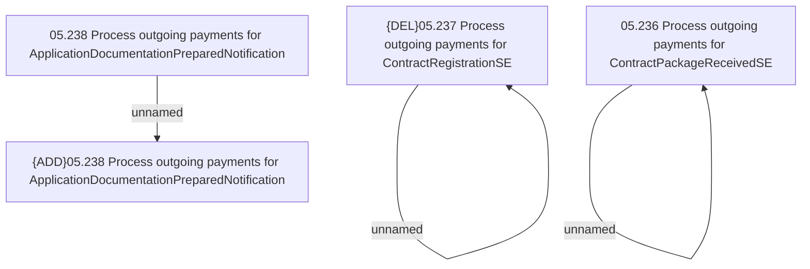

# Access Rights

- **Diagram Type**: Custom
- **Package**: HomerSelect/BSL/Analysis Model/Payments/Outgoing payments/Process internal system events and notifications for outgoing payments/Access Rights
- **Diagram ID**: 119575
- **Elements**: 6
- **Connectors**: 3

